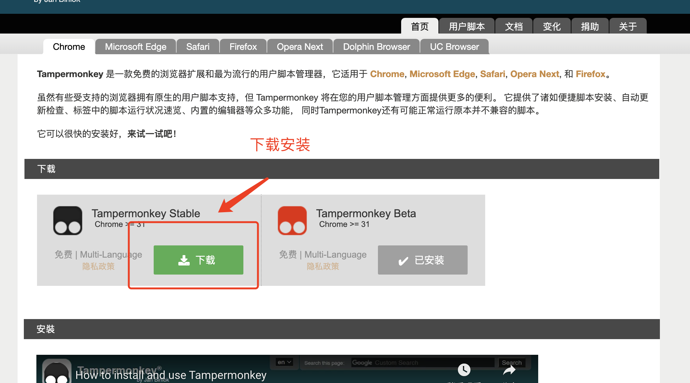

# **插件教程**

用于刷课的油猴脚本，脚本运行在 `Firefox/93.0` 浏览器 项目地址： [https://github.com/mydaoyuan/course-script](https://github.com/mydaoyuan/course-script)

## 安装**方式**

### 安装油猴插件

首先安装 [油猴插件](https://www.tampermonkey.net/#) 到浏览器。

看到浏览器右上角有个图标就表明安装成功了！

### 安装刷课插件

打开插件地址 [https://greasyfork.org/en/scripts/434681-autoplayvideo](https://greasyfork.org/en/scripts/434681-autoplayvideo)

点击安装

接着会进入插件**详情页面，**再次点击install，确认安装

点击后页面会自动关闭，这是正常现象

## 使用

### 验证是否安装成功

安装完插件后，**重新打开**课程页面 [https://cejlu.yuketang.cn/pro/courselist](https://cejlu.yuketang.cn/pro/courselist)  

可以看到多了一个角标，表示当前网站运行了一个插件（也就是我们的刷课插件）

### 权限处理

浏览器为了保护用户，会对脚本打开网页做限制。左上角会有一行询问文字。**点击 Allow pop-ups .. 即可正常**

PS： 如果是老版本的可能需要自己手动处理一下后再刷新页面

例如这样 ：

恭喜到这里就大功告成了 💪

## 温馨提示

有时候可能因为网络问题，视频不能正常播放，可以通过关闭所有网页，重新打开课程页面 [https://cejlu.yuketang.cn/pro/courselist](https://cejlu.yuketang.cn/pro/courselist) 解决。